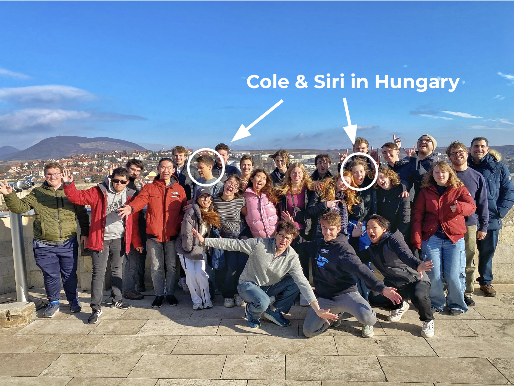

```{r global, include=FALSE, message=FALSE}
library(tidyverse)
library(knitr)
library(highcharter)
library(plotly)
library(ggrepel)
library(forcats)
library(shinydashboard)
library(sf)
library(rnaturalearth)
library(wbstats)
library(leaflet)
library(DT)
library(ggplot2)
library(readr)
studyabroad <- read_csv("studyabroad.csv")
```

About
==========================

Column {data-width = 400}
-------------------------


```{r  fig.width = 7, fig.height = 5, fig.align='center'}
 
```

#### Authors

Siri Sagedahl and Cole Monson

#### The Story 

This past January, Cole and Siri went on a study abroad program to Budapest, Hungary. It was both of our first times studying abroad and it made us realize the complexities of traveling to another location for extended periods of time. Despite only living in Budapest for a month, the stark cultural differences were apparent in our daily lives. One of these differences between Minnesota and Budapest was the acceptance of LGBTQ+ identifying people. The conservative government limits general LGBTQ+ rights and the solitary social culture is far less accepting than the United States. As an LGBTQ+ identifying person, Siri had to look into this culture prior to traveling to Hungary. 

This project is a way to make this research more accessible to LGBTQ+ students looking to study abroad. Knowing how the new culture you're being immersed into sees your identity is very important for students' overall well being while away. **This app connects programs to indecies of LGBTQ+ acceptance levels, allowing students to explore the country's culture prior to committing to a program.**

Our main source of information for this project comes to us from Equaldex, a collaborative knowledge base on LGBTQ rights. Their mission statement is to ["crowdsource laws and public opinion data related to LGBTQ+ rights to provide a comprehensive and global view of the LGBTQ+ rights movement. Using community-verified data, Equaldex can automatically score and rank every country and region's Equality Index to measure the progress of LGBTQ+ rights. Data is contributed, maintained, and community-verified by thousands of volunteer editors, with the help of reports from the general public."](https://www.equaldex.com/about)


About the index: 

The equality indices are ranged from 0 to 100 and are split into three main categories: **general, legal, and public opinion**. According to the equality index methodology, the "LGBT legal index measures the current legal status of 13 different issues ranging from the legal status of homosexuality, same-sex marriage, transgender rights, LGBT discrimination protections, LGBT censorship laws, and more. Each topic is weighted differently" based on its relative importance. The public opinion index "measures the public attitudes towards LGBT people using surveys and polls from reputable organizations. This index is scored based on averaging the results of all surveys in a given region." Additionally, the scores are weighted using a time-decay weighting method based on the date the survey was published. Finally, the equality index is the average of legal index and public opinion index.

Our final dataset, as displayed to the right, matches the location to these indices. Due to the fact that many programs visit more than one location within their time abroad, each observation represents a unique program-location pair.

#### Data Sources

+ Equality indices from [Equaldex](https://www.equaldex.com/equality-index) 
+ Study abroad information from [St. Olaf Smith Center](https://stolaf.studioabroad.com/index.cfm?FuseAction=Programs.SimpleSearch)

<center>

The following is an extensive table of the study abroad programs offered by the Smith Center:


```{r fig.width = 7, fig.height = 5, fig.align='center'}
renderTable({
  studyabroad |>
    select(program_name, city, country, equality_index, legal_index, public_opinion_index) |>
    rename(Program = program_name,
           City = city,
           Country = country,
           `General Equality Index` = equality_index,
           `Legal Index` = legal_index,
           `Public Opinion Index` = public_opinion_index)
})
```


Equality by Program
==========================


```{r}
map <- ne_countries(returnclass = "sf")
names(map)[names(map) == "iso_a3"] <- "ISO3"
names(map)[names(map) == "name"] <- "NAME"
```

```{r}
map$equality_index <- studyabroad[match(map$NAME, studyabroad$country), ]$equality_index
map$legal_index <- studyabroad[match(map$NAME, studyabroad$country), ]$legal_index
map$public_opinion_index <- studyabroad[match(map$NAME, studyabroad$country), ]$public_opinion_index
```


<center>

### Study Abroad Opportunities for the 2024-2025 School Year


```{r}
pal <- colorBin(
  palette = "viridis", domain = map$equality_index,
  bins = seq(0, max(map$equality_index, na.rm = TRUE) + 10, by = 10)
)


map$labels <- paste0(
  "<strong> Country: </strong> ",
  map$NAME, "<br/> ",
  "<strong> Equality Index: </strong> ",
  map$equality_index, "<br/> ",
  "  - Legal Index: ", 
  map$legal_index, "<br/> ",
  "  - Social Index: ",
  map$public_opinion_index, "<br/> "
) %>%
  lapply(htmltools::HTML)


mapFiltered <- reactive({
  rowsinrangeslider <- which(map$equality_index >= input$rangevalues[1] &
    map$equality_index <= input$rangevalues[2])
  map[rowsinrangeslider, ]
})

renderLeaflet({
  if (nrow(mapFiltered()) == 0) {
    return(NULL)
  }

  leaflet(mapFiltered()) %>%
    addTiles() %>%
    setView(lng = 0, lat = 30, zoom = 1.5) %>%
    addPolygons(
      fillColor = ~ pal(equality_index),
      #color = "white",
      weight = 2,
      fillOpacity = 0.7,
      label = ~labels,
      highlight = highlightOptions(
        color = "black",
        bringToFront = TRUE
      )
    ) %>%
    leaflet::addLegend(
      pal = pal, values = ~equality_index,
      opacity = 0.7, title = "Equality Index"
    )
})
```

```{r}
minvalue <- floor(min(map$equality_index, na.rm = TRUE))
maxvalue <- ceiling(max(map$equality_index, na.rm = TRUE))

sliderInput("rangevalues",
  label = "Equality Index Ratings:",
  min = minvalue, max = maxvalue,
  value = c(minvalue, maxvalue)
)
           
```


```{r}
click_tract <- eventReactive(input$map_shape_click, {

    x <- input$map_shape_click

    y <- x$id

    return(y)

  })

tract_ids <- reactive({
  eventdata <- event_data("plotly_selected", source = "source")
  if (is.null(eventdata)) {

    return(NULL) # do nothing

  } else {

    tracts <- eventdata$key

    return(tracts)
  }
})


observe({
  
  req(tract_ids())
  
  proxy <- leafletProxy('map')
  
  sub <- filter(metro(), tract_id %in% tract_ids())

  box <- st_bbox(sub) %>% as.vector()

  # Clear old selection on map, and add new selection
  proxy %>%
    clearGroup(group = 'sub') %>%
    addPolygons(data = sub, fill = FALSE, color = '#FFFF00',
                 opacity = 1, group = 'sub', weight = 1.5) %>%
    fitBounds(lng1 = box[1],
              lat1 = box[2],
              lng2 = box[3],
              lat2 = box[4])

})


observeEvent(click_tract(), {

  # Add the clicked tract to the map in aqua, and remove when a new one is clicked
  map <- leafletProxy('map') %>%
      removeShape('htract') %>%
      addPolygons(data = filter(metro(), tract_id == click_tract()), fill = FALSE,
                  color = '#00FFFF', opacity = 1, layerId = 'htract', 
                  weight = 1.6)

  })


tract_data <- reactive({

    # Fetch data for the clicked tract
    return(filter(metro(), tract_id == click_tract()))

})
```

This plot shows us not only the countries available for the upcoming school year, but how each of these rank based on our three equality metrics. 

Western Europe is consistently the most accepting with the highest ranking in the world being Norway, but this tolerance seems to drop the further east we travel. The continent of Africa has the lowest ratings, with a score of just 7 coming from Ghana. Southeast Asia is the most middle-of-the-road region with India being towards the higher percentile, but China having a lower than average score. However, these values do not necessarily reflect the quality of the study abroad programs, and are a general overview of the countries as a whole. Typically the locations of these opportunities are capital cities or other more tolerant areas of their respective nations. 

```{r, echo=FALSE}
#renderPlot({
#highchart() %>%
  #hc_add_series_map(
    #worldgeojson, studyabroad, value = "equality_index", joinBy = c('name','country'),
    #name = "Equality Index"
    #)  %>% 
  #hc_colorAxis(stops = color_stops()) %>% 
  #hc_title(text = "Equality Index in St. Olaf Study Abroad Programs") %>% 
  #hc_subtitle(text = "St. Olaf Study Abroad Program Locations")
#})
```


St. Olaf Study Abroad
==========================

These two halves of the screen showcase two different ideas. 

On the left we have a ranking of the most common countries offered to St. Olaf students. Unsurprisingly, the UK and the US are at the top with other English speaking countries not too far from the top as well like Australia and South Africa. 

Meanwhile on the right, we have each program sectioned off into the different subjects they represent. Students majoring in a natural science field clearly have no shortage of opportunities available to them next year, while others may only have one country/program open to them for travel. Among these are Math, Dance, and Social Work to name a few. 


Column 
-------------------------

```{r, echo = FALSE}
renderPlot(studyabroad |>
  group_by(country) |>
  summarize(n = n()) |>
  mutate(country = fct_reorder(country, n)) |>
  slice_max(country, n = as.numeric(input$num_adjust)) |>
  ggplot(aes(x = country, y = n)) +
  geom_col(fill = "goldenrod2") +
  theme(axis.text.x = element_text(angle = 90)) +
  labs(x = "Country", y = "Num Occurrences", title = "Most Frequently Visited Destinations"))

inputPanel(
  
  sliderInput("num_adjust", label = "Number of Countries:",
              min = 5, max = 20, value = 1, step = 1),
)
```

```{r, echo = FALSE}
renderDataTable({
    studyabroad |>
    as_tibble() |>
      group_by(country) |>
      summarize(n = n()) |>
      mutate(country = fct_reorder(country, n)) |>
      slice_max(country, n = as.numeric(input$num_adjust)) |>
    rename(`Number of Programs` = n,
           Country = country)
})
```

Column
-------------------------


```{r}
renderPlot({studyabroad |>
            filter(detected_subject == input$subject) |>
             group_by(country) |>
             summarize(n = n()) |>
             ggplot(aes(x = country, y = n)) +
             geom_col(fill = "deeppink1") +
    labs(title = "Program Locations by Subject", x = "Country", y = "Number of Programs")
  })


inputPanel(
    selectInput("subject", "Choose Subject:",
            choices = c("Math" = "math", 
                        "Natural Science" = "science", 
                        "Environmental Science" = "environment", 
                        "Art" = "art",
                        "Dance" = "dance", 
                        "Social Work" = "social work", 
                        "Classical Studies" = "classic", 
                        "Theater" = "theater", 
                        "Music" = "music", 
                        "Economics" = "econ", 
                        "Education/Student Teaching" = "teaching"),
            selected = "science")
)
```

Global Equality
==========================

**Plot Descriptions**

EQUALITY INDEX: This bar chart represents the average Equality Index level by continent. This measurement takes the average between legal and public opinion index. South America and Europe are tied for having the highest score, while Africa has the lowest. The blue dashed line represents the global average score.

LEGAL INDEX: This bar chart represents the average Legal Index level by continent. This score "measures the current legal status of 13 different issues ranging from the legal status of homosexuality, same-sex marriage, transgender rights, LGBT discrimination protections, LGBT censorship laws, and more" (Equaldex). South America once again has the highest overall score and Africa once again has the lowest. The blue dahsed line represents the global average score.

PUBLIC OPINION: This bar chart represents the average Public Oppinion Index level by continent. This score "measures the public attitudes towards LGBT people using surveys and polls from reputable organizations[...] averaging the results of all surveys in a given region" (Equaldex). Europe has the highest score with South America in a close second, with Africa once again having the lowest score.

STUDY ABROAD LOCATION PUBLIC OPINION vs. LEGAL INDEX: This scatterplot displays the relationship between legal and public opinion index in the countries where St. Olaf has study abroad programs. There is a clear positive correlation between these two variables. As one increases, the other also tends to increase. The points are labeled and colored by continent. There are the most European countries in the upper right-hand corner, therefore we can infer that Europe tends to have both high legal index and public opinion index. There are several African countries occupying the lower left-hand corner, therefore we can infer Africa tends to have low legal and public opinion indices. 


Row {.tabset .tabset-fade}
-------------------------
### Equality Index

```{r, echo = FALSE}
renderPlot({
   average_equality <- studyabroad |>
      select(equality_cont) |>
      summarise(avg_equality = mean(equality_cont, na.rm = TRUE)) |>
      pull(avg_equality)
   
   studyabroad |>
      select(region, equality_cont, legal_cont, po_cont) |>
      group_by(region) |>
      mutate(region_id = row_number()) |>
      filter(region_id == 1) |>
  ggplot(aes(x = fct_reorder(region, equality_cont), y = equality_cont, fill = region)) +
  geom_col() +
  coord_flip() +
  geom_hline(yintercept = average_equality, linetype = "dashed", color = "skyblue", size = 1) +
     annotate("text", x = Inf, y = average_equality, label = "Global Average", vjust = -0.5, hjust = 1, color = "skyblue") +
      labs(x = "Continent", y = "Equality Index Value", 
           title = "Equality Index by Continent", fill = "Continent") +
      theme_minimal()
  })
"This bar chart represents the average Equality Index level by continent. South America and Europe are tied for having the highest score, while Africa has the lowest. The blue dashed line represents the global average score."
```

### Legal Index

```{r}
renderPlot({
   average_legal <- studyabroad |>
      select(legal_cont) |>
      summarise(avg_legal = mean(legal_cont, na.rm = TRUE)) |>
      pull(avg_legal)
  
    studyabroad |>
      select(region, equality_cont, legal_cont, po_cont) |>
      group_by(region) |>
      mutate(region_id = row_number()) |>
      filter(region_id == 1) |>
    ggplot(aes(x = fct_reorder(region, legal_cont), y = legal_cont, fill = region)) +
  geom_col() +
    coord_flip() +
    geom_hline(yintercept = average_legal, linetype = "dashed", color = "skyblue", size = 1) +
     annotate("text", x = Inf, y = average_legal, label = "Global Average", vjust = -0.5, hjust = 1, color = "skyblue") +
  labs(x = "Continent", y = "Legal Index Value", 
           title = "Legal Index by Continent", fill = "Continent") +
      theme_minimal()
})
```

### Public Opinion Index

```{r, echo = FALSE}
renderPlot({
  average_po <- studyabroad |>
      select(po_cont) |>
      summarise(avg_po = mean(po_cont, na.rm = TRUE)) |>
      pull(avg_po)
   studyabroad |>
      select(region, equality_cont, legal_cont, po_cont) |>
      group_by(region) |>
      mutate(region_id = row_number()) |>
      filter(region_id == 1) |>
  ggplot(aes(x = fct_reorder(region, po_cont), y = po_cont, fill = region)) +
  geom_col() +
  coord_flip() +
     geom_hline(yintercept = average_po, linetype = "dashed", color = "skyblue", size = 1) +
     annotate("text", x = Inf, y = average_po, label = "Global Average", vjust = -0.5, hjust = 1, color = "skyblue") +
      labs(x = "Continent", y = "Public Opinion Index Value", 
           title = "Public Opinion Index by Continent", fill = "Continent") +
      theme_minimal()
  })
```


Row
-------------------------
```{r, echo=FALSE}
selectInput("region", "Choose Continent:",
            choices = c("Africa", "Asia", "Europe", "North America", "Oceania", "South America"),
            multiple = TRUE,
            selected = "Africa")
```

```{r, echo = FALSE}
renderPlot({
  studyabroad |>
      group_by(country) |>
      mutate(country_id = row_number()) |>
      filter(country_id == 1,
             region %in% input$region) |>
    ggplot(aes(x = public_opinion_index, y = legal_index, label = country, color = region)) +
    geom_point() +
    geom_text_repel() +
    labs(title = "Study Abroad Location Public Opinion vs. Legal Index", x = "Public Opinion Index", y = "Legal Index", color = "Continent")
})
```

```{r}
valueBoxOutput("equalityGauge")
valueBoxOutput("legalGauge")
valueBoxOutput("poGauge")
```

```{r}
server <- function(input, output, session) {
  output$equalityGauge <- renderValueBox({
    avg_equality <- studyabroad |>
      summarize(avg_equality = mean(equality_cont, na.rm = TRUE)) |>
      pull(avg_equality)
    valueBox(value = round(avg_equality, 2), subtitle = "Global Average Equality Index")
  })
  
  output$legalGauge <- renderValueBox({
    avg_legal <- studyabroad |>
      summarize(avg_legal = mean(legal_cont, na.rm = TRUE)) |>
      pull(avg_legal)
    valueBox(value = round(avg_legal, 2), subtitle = "Global Average Legal Index")
  })
  
  output$poGauge <- renderValueBox({
    avg_po <- studyabroad |>
      summarize(avg_po = mean(po_cont, na.rm = TRUE)) |>
      pull(avg_po)
    valueBox(value = round(avg_po, 2), subtitle = "Global Average Public Opinion Index")
  })
}
shinyApp(ui = dashboardPage(
  dashboardHeader(disable = TRUE),
  dashboardSidebar(disable = TRUE),
  dashboardBody(fluidPage(
    uiOutput("equalityGauge"),
    uiOutput("legalGauge"),
    uiOutput("poGauge")
  ))
), server)
```

Conclusions
==========================

#### Pulling It Together

The process of aggregating this data into meaningful and accessible data visualizations took time and effort. As stated in our introduction, we gathered the majority of our data from scraping a website called [Equaldex](https://www.equaldex.com/equality-index). Our study abroad information was scraped from the [St. Olaf Smith Center](https://stolaf.studioabroad.com/index.cfm?FuseAction=Programs.SimpleSearch). Yet, by far the most challenging aspect of our entire project was the creation of our map. There are many R packages that can create beautiful maps, but unfortunately none that have the exact interactive comonent that we wanted to include. This left us to struggle with Leaflet to create our final project, which is not a very maleable package, especially in R Shiny.

#### Conclusions

This project aimed to connect LGBTQ+ identifying students to an accessible resource to identify the acceptance levels of study abroad locations. In the process, we learned a lot about how the LGBTQ+ community is received on a global scale, as well as how St. Olaf study abroad programs are distributed throughout the globe.

Our research revealed that the most welcoming study abroad destinations for students through St. Olaf include Canada, Norway, Germany, Spain, Denmark, and the Netherlands. The least acceptance locations include Ghana, Cameroon, Tanzania, and Kenya. **However, despite these numbers, the choice to study abroad is ultimately an individual decision. Many factors can influence a students' choice in program, this is simply one of those factors. An acceptance index does not guarantee safety, health or wellness while abroad.**

```{r  fig.width = 7, fig.height = 5, fig.align='center'}
 
```
*Image taken by Siri from Budapest, Hungary